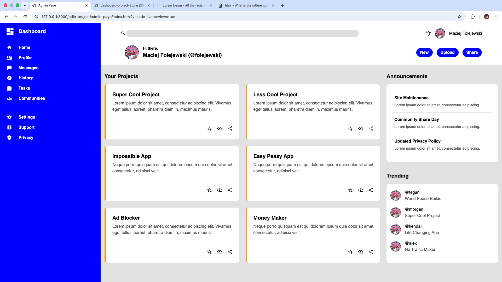

# The Odin Project
Exercises and projects completed while working through The Odin Project's Full Stack JavaScript path.

## Intermediate HTML and CSS

### Sign Up Form

A sign up page built to practice forms.

#### Live preview
https://folejewski.github.io/odin-project/form-page/index.html

#### What I practiced
- CSS `@font-face` for custom fonts (Norse, Roboto)
- Flexbox layout (two-column form rows, image and content split)
- Form validation with `pattern`, `required`, and the `:user-invalid` and `:focus` pseudo-classes
- Vanilla JS to check if password and confirm-password match

#### Built with
- HTML
- CSS

#### Assignment
https://www.theodinproject.com/lessons/node-path-intermediate-html-and-css-sign-up-form

#### My Solution

### Admin Dashboard

A dashboard layout built to practice CSS Grid, including nested grids.

#### Live preview
https://folejewski.github.io/odin-project/admin-page/index.html

#### What I practiced
- CSS Grid and nested grid containers
- Structuring a multi-section layout (sidebar, header, content) entirely with Grid rather than Flexbox
- Working with inline SVG icons

#### Built with
- HTML
- CSS
- Vanilla JavaScript

#### Goal
https://www.theodinproject.com/lessons/node-path-intermediate-html-and-css-admin-dashboard

#### My Solution
