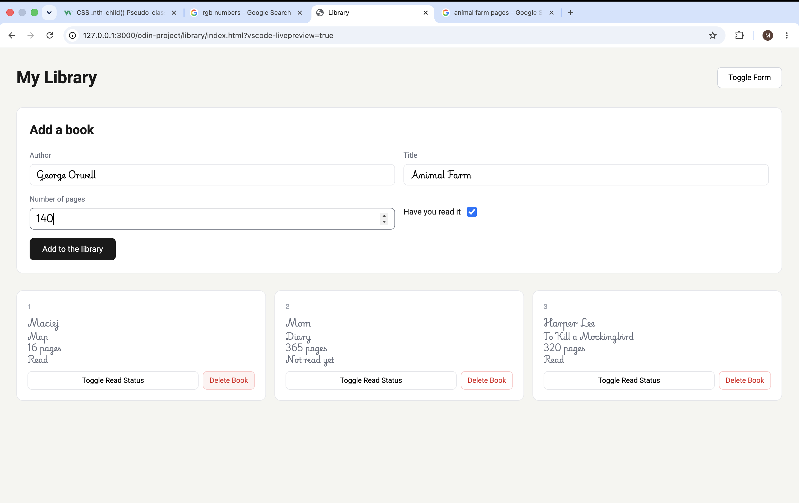
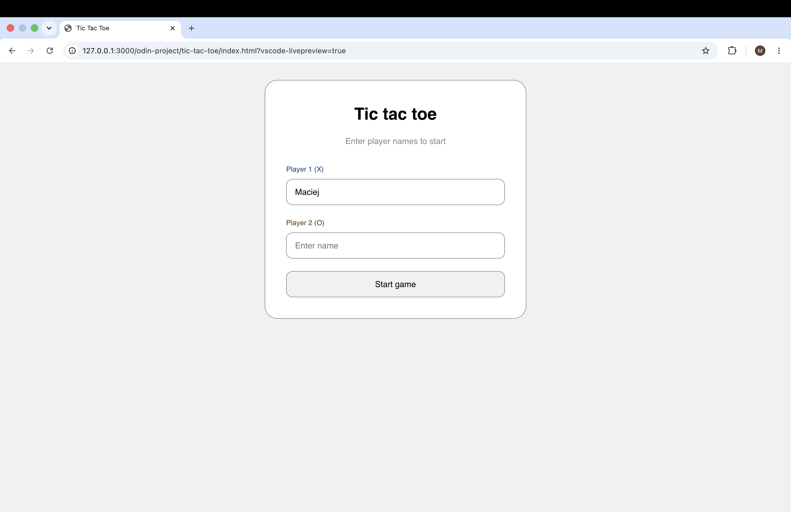
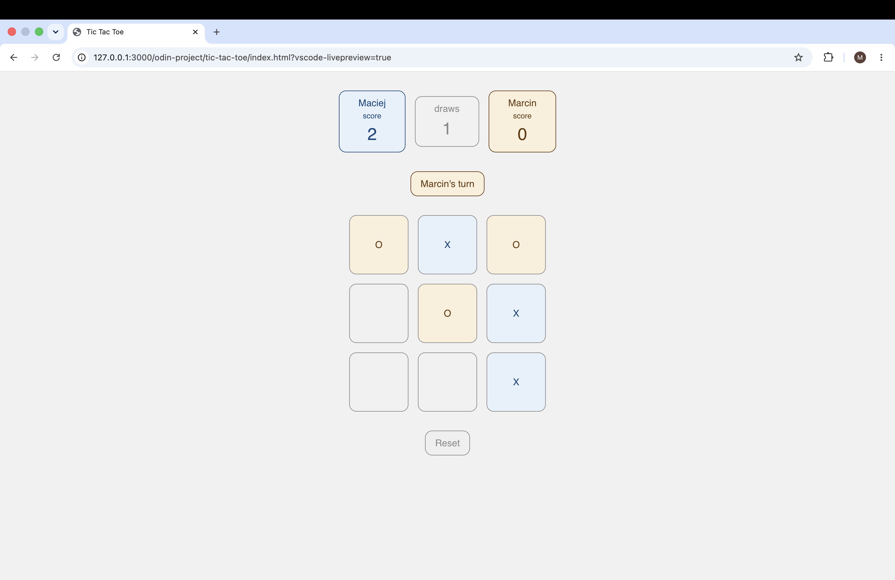
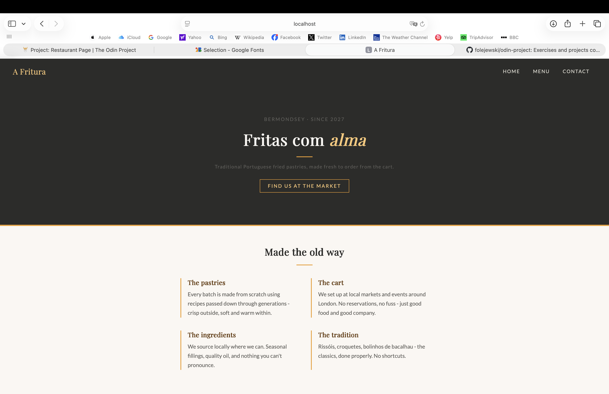
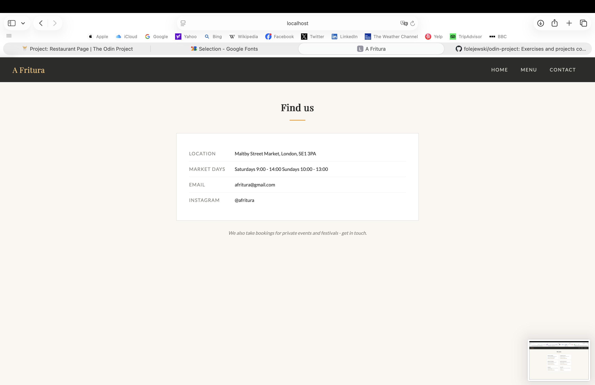
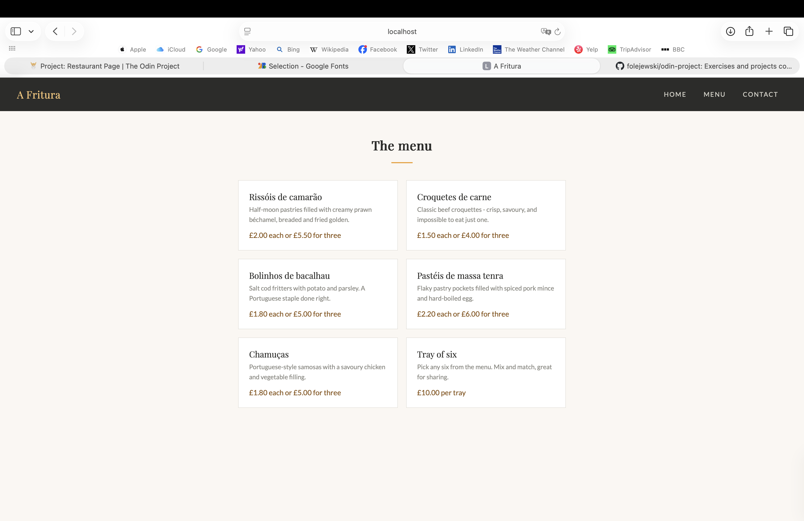

# The Odin Project
Exercises and projects completed while working through The Odin Project's Full Stack JavaScript path.

## Intermediate HTML and CSS

### Sign Up Form

A sign up page built to practice forms.

#### Live preview
https://folejewski.github.io/odin-project/form-page/index.html

#### What I practiced
- CSS `@font-face` for custom fonts (Norse, Roboto)
- Flexbox layout (two-column form rows, image and content split)
- Form validation with `pattern`, `required`, and the `:user-invalid` and `:focus` pseudo-classes
- Vanilla JS to check if password and confirm-password match

#### Built with
- HTML
- CSS
- Vanilla JavaScript

#### Assignment
https://www.theodinproject.com/lessons/node-path-intermediate-html-and-css-sign-up-form

#### My Solution

### Admin Dashboard

A dashboard layout built to practice CSS Grid, including nested grids.

#### Live preview
https://folejewski.github.io/odin-project/admin-page/index.html

#### What I practiced
- CSS Grid and nested grid containers
- Structuring a multi-section layout (sidebar, header, content) entirely with Grid rather than Flexbox
- Working with inline SVG icons

#### Built with
- HTML
- CSS

#### Assignment
https://www.theodinproject.com/lessons/node-path-intermediate-html-and-css-admin-dashboard

#### My Solution

## JavaScript

### Library

A book library app built to practice JavaScript objects, constructors, and DOM manipulation.

#### Live preview
https://folejewski.github.io/odin-project/library/index.html

#### What I practiced
- Constructor functions and `new.target` guard
- Prototype methods (`Book.prototype.toggleRead`)
- `crypto.randomUUID()` for stable object identifiers
- DOM manipulation with `createElement`, `innerHTML`, and event delegation via `onclick`
- `FormData` API for reading form values

#### Built with
- HTML
- CSS
- Vanilla JavaScript

#### Assignment
https://www.theodinproject.com/lessons/node-path-javascript-library

#### My Solution

### Tic Tac Toe

A two-player tic tac toe game built to practice factory functions and the module pattern.

#### Live preview
https://folejewski.github.io/odin-project/tic-tac-toe/index.html

#### What I practiced
- Factory functions and IIFE to minimise global code
- Separating game logic (`gameController`) from DOM manipulation (`displayController`)
- Closures for private state (board array, scores, turn tracking)
- Event-driven game flow without loops, just click handlers reacting to state
- Dynamic DOM updates (cell colours, turn indicator, score tracking)

#### Built with
- HTML
- CSS
- Vanilla JavaScript

#### Assignment
https://www.theodinproject.com/lessons/node-path-javascript-tic-tac-toe

#### My Solution

### Restaurant Page

A dynamically rendered restaurant homepage for a Portuguese fried pastries food cart, built to practice webpack and DOM manipulation with JavaScript modules.

#### Source
https://github.com/folejewski/odin-project/tree/main/restaurant-page

#### What I practiced
- Webpack setup and bundling with `html-webpack-plugin`, `css-loader`, and `style-loader`
- Generating all DOM content with JavaScript and no hardcoded HTML in the content div
- Splitting UI into modules (`home.js`, `menu.js`, `contact.js`), each exporting a single render function
- Tab switching logic with event listeners clearing and re-rendering `div#content`
- CSS custom properties for a consistent colour palette
- Custom fonts via `@font-face`

#### Built with
- HTML
- CSS
- Vanilla JavaScript
- Webpack

#### Assignment
https://www.theodinproject.com/lessons/node-path-javascript-restaurant-page

#### My Solution

### Recursion

Implementations of classic recursive algorithms: Fibonacci sequence and merge sort.

#### Source
https://github.com/folejewski/odin-project/tree/main/recursion

#### What I practiced
- Iterative and recursive approaches to the same problem
- Base cases and recursive cases
- Running JavaScript from the command line with Node.js

#### Built with
- Vanilla JavaScript
- Node.js

#### Assignment
https://www.theodinproject.com/lessons/javascript-recursion

### Linked List

A linked list data structure implemented from scratch in JavaScript.

#### Source
https://github.com/folejewski/odin-project/tree/main/linked-list

#### What I practiced
- Building a data structure from scratch using classes
- Node traversal via `nextNode` pointers
- Implementing standard list operations: `append`, `prepend`, `pop`, `insertAt`, `removeAt`
- Error handling with `RangeError` for out-of-bounds operations

#### Built with
- Vanilla JavaScript
- Node.js

#### Assignment
https://www.theodinproject.com/lessons/javascript-linked-lists
